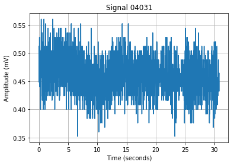
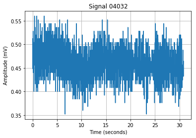
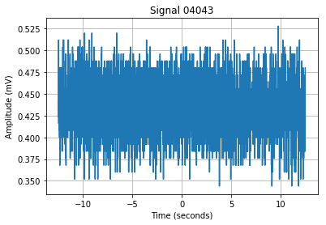
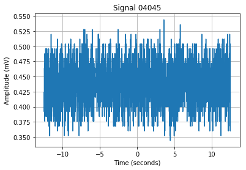
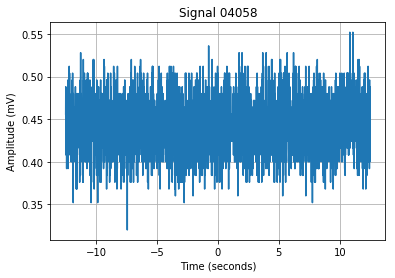
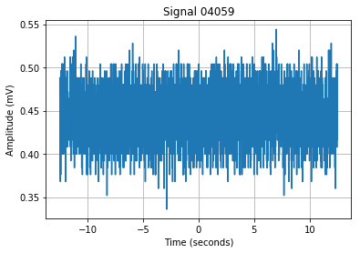
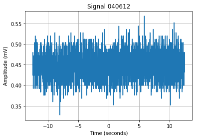
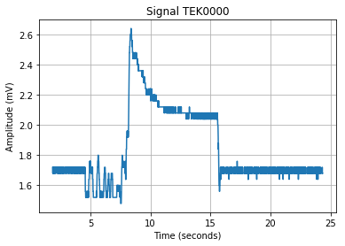

```python
import os
import ast
import matplotlib.pyplot as plt

raw_signal_path = """raw_signal/"""

for filename in os.listdir(raw_signal_path):
        data = []
        if (not filename.endswith('.ipynb_checkpoints')):
            
            # fetch signal from file
            with open(raw_signal_path + filename) as fin:
                data = ast.literal_eval(fin.read())
               
            # plot signal
            plt.plot(*zip(*data))
            plt.title('Signal ' + filename)
            plt.ylabel('Amplitude (mV)')
            plt.xlabel('Time (seconds)')
            plt.grid()
            plt.show()
```


























```python

```
